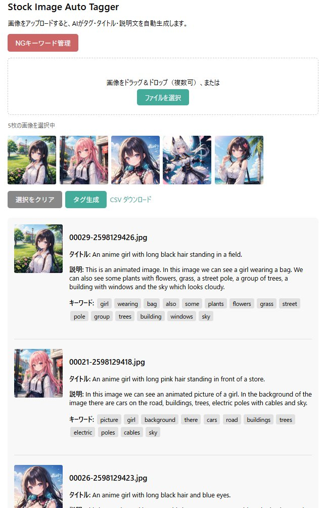

# Stock Image Auto Tagger

フォトストック向けに、画像からタグ・タイトル・説明文を自動生成するサーバーです。



## 概要

* 画像をドラッグ＆ドロップすると即座に AI がタグ付け
* **Florence-2**（キャプション）+ **RAM++**（キーワード）
* FastAPI + Docker + NVIDIA GPU
* WebUI（英語）と REST API

## クイックスタート

```bash
cp .env.example .env   # 初回のみ
docker compose up -d --build
```

| | |
|--|--|
| **WebUI** | http://localhost:7861 |
| **Health** | `GET /health` |
| **タグ生成** | `POST /tag`（multipart `files`） |
| **CSV API** | `POST /tag.csv` |
| **翻訳フォールバック** | `POST /translate`（表示用 en→ja） |

初回は Florence-2（約 1GB）と RAM++（約 3GB）のダウンロードが発生します。

## 主な WebUI 機能

* DnD / ファイル選択で即タグ生成（進捗 `n/m` + バー）
* 結果サムネ拡大プレビュー（Title / Caption / Keywords、前後ナビ）
* **Blocking mode**: 不要キーワードを一括 NG 登録（localStorage）
* **Download CSV** / **Download ZIP**（JPEG は Exif に title/caption/keywords 埋め込み）
  * ZIP には画像のみ同梱（Chrome の ZIP+CSV ブロック回避）。メタは CSV を別途ダウンロード
* ブラウザ言語が日本語のとき、Title / Caption を日本語表示
  * Chrome Translator API があれば優先、なければサーバー経由フォールバック
* キーワードの自動翻訳は未実装（保留）

## E2E テスト（Playwright）

Docker 上の WebUI（`http://localhost:7861`）に対して実行します。

```bash
npm install
npx playwright install --with-deps chromium
docker compose up -d
npm test              # 全件
npm run test:smoke    # UI / health のみ
npm run test:gpu      # タグ生成（GPU）込み
```

詳細は `e2e/` と `playwright.config.ts` を参照。`BASE_URL` で接続先変更可。

## API 例

```bash
curl -s http://localhost:7861/health

curl -s -F "files=@photo.jpg" http://localhost:7861/tag | jq .

curl -s -X POST http://localhost:7861/translate \
  -H 'Content-Type: application/json' \
  -d '{"text":"A red apple","source":"en","target":"ja"}'
```

## ドキュメント

| ファイル | 内容 |
|----------|------|
| [ARCHITECTURE.md](./ARCHITECTURE.md) | 技術仕様・アーキテクチャ |
| [HANDOVER.md](./HANDOVER.md) | 運用・引継ぎ |
| [LICENSE](./LICENSE) | MIT |
| [THIRD_PARTY_LICENSES.md](./THIRD_PARTY_LICENSES.md) | 第三者ライセンス |

## 使用モデル・ライブラリ

| コンポーネント | 用途 | ライセンス |
|----------------|------|------------|
| [Florence-2](https://huggingface.co/florence-community/Florence-2-base-ft) | キャプション | MIT |
| [RAM++](https://github.com/xinyu1205/recognize-anything) | タグ | Apache 2.0 |
| JSZip / piexifjs | ZIP・Exif（WebUI） | MIT |

## ディレクトリ構成（抜粋）

```
stock-tagger/
├── app/                 # FastAPI（main / tagger / ram_tag / utils）
├── ram/                 # Recognize Anything 組み込み
├── static/              # favicon, jszip, piexif
├── e2e/                 # Playwright
├── data/hf_cache/       # モデルキャッシュ（gitignore）
├── docker-compose.yml
└── Dockerfile
```

## 現状と次の課題

**実装済み**: Florence-2 + RAM++、WebUI 一式、Blocking mode、CSV/ZIP+Exif、日英表示翻訳、Playwright E2E

**今後**:

1. タグランキング（ストック向け重要度順）
2. サイト別 CSV（Adobe Stock / Shutterstock 等）
3. バッチ並列化（キュー / マルチワーカー）
4. キーワード翻訳（要否検討中）

詳細は [ARCHITECTURE.md](./ARCHITECTURE.md) と GitHub Issues を参照。
